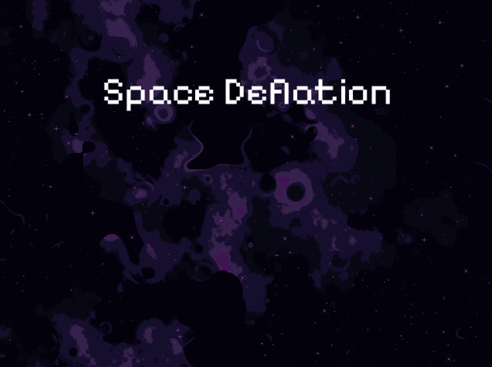

# Space Deflation
Game developed with Go and [ebitengine](https://ebitengine.org/) for the itch.io's 2024 GMTK Game Jam - Built to Scale

## Controls

**Key**|**Action**
-|-
←/A | Steer left
→/D | Steer right
↑/W | Propulsion

## Building
`go build src/main.go` to build for your current platform, and

`make web` for web (`make serve` to serve it using python)

`make windows` for windows build

## Running
`go run src/main.go`

## Special thanks
* ebitengine contributors
* deep-fold.itch.io for the background images
